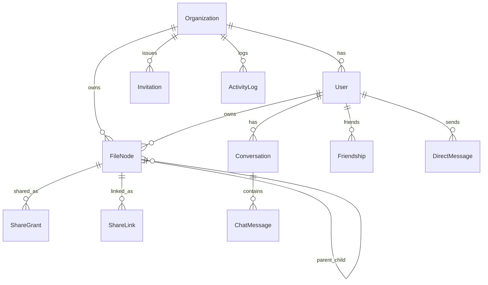
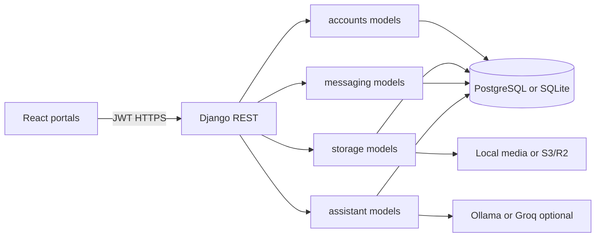

# Cloud Based Storage System — Architecture Guide

This is the single project documentation file. It explains what the system does, which tools it uses, how OOP is applied, how models relate, and how the main flows work.

For **algorithms** (malware scan, hashing, TOTP, TF-IDF summarizer) and each one’s responsibility, see [ALGORITHMS.md](./ALGORITHMS.md).

---

## 1. What the system is

Cloud Based Storage System is a **multi-tenant cloud storage** application.

- Each **organization** (workspace) keeps its own users and files.
- People use different **portals** so the wrong role cannot open the wrong UI.
- A Django REST API stores data and enforces permissions.
- A React frontend talks to that API with JWT tokens.

| Portal URL | Role | Purpose |
| --- | --- | --- |
| `/user` | `user` | Upload, browse, share, trash, friends chat, AI chat |
| `/admin` | `admin` | Manage workspace users, personal quotas, analytics, settings |
| `/system` | `superadmin` | Manage all workspaces, allocate total storage, manage admins |

Comment: portals keep separate JWT keys in the browser (`nexus_user_*`, `nexus_admin_*`, `nexus_system_*`), so one tab does not overwrite another.

---

## 2. Features

| Area | What it does |
| --- | --- |
| Auth | Register, login, logout, password change, portal lock |
| Two-factor (2FA) | TOTP with Google Authenticator; secret encrypted at rest |
| Workspaces | Organizations with slug, flags, suspend/reactivate |
| Invites & accounts | SMTP emails with login URL; create-user emails include email + temporary password; invite-link emails include accept URL |
| Files & folders | Tree storage, star, rename, move, duplicate |
| Trash | Soft delete, restore, permanent delete, empty trash |
| Sharing | Email grants (accept/ignore) and public secure links |
| Antivirus | Scan before save (heuristic by default; optional ClamAV) |
| Quotas | Super admin sets workspace total; admin sets per-user personal quota |
| Friends chat | Org-scoped friendships and direct messages |
| AI assistant | Local file summary + optional Ollama/Groq metadata chat |
| Admin analytics | Org storage, activity, growth charts |
| Super admin | Create/suspend/delete workspaces; allocate storage; manage admins |
| Activity log | Audit actions such as upload, share, delete |

---

## 3. Tools and stack

### Backend (`backend/requirements.txt`)

| Tool | Role in this project |
| --- | --- |
| Django 5.2 | Web framework, ORM, admin, migrations |
| Django REST Framework | JSON APIs, viewsets, serializers |
| SimpleJWT | Access + refresh tokens (rotate + blacklist) |
| django-cors-headers | Allow Vite frontend origin |
| django-filter | Query filtering on list APIs |
| PostgreSQL (`psycopg`) | Primary database |
| SQLite (`USE_SQLITE=true`) | Local smoke tests only |
| django-storages[s3] | Optional S3 / Cloudflare R2 file storage |
| gunicorn | Production WSGI server |
| cryptography + pyotp + qrcode | Encrypt TOTP secrets; verify codes; QR enrollment |
| Pillow | Image handling |
| pypdf, pymupdf, python-docx, openpyxl, python-pptx | Extract text from documents for AI |
| rapidocr-onnxruntime | OCR for scanned images/PDFs |
| httpx | Call Ollama / Groq HTTP APIs |
| python-dotenv | Load `.env` settings |

### Frontend (`package.json`)

| Tool | Role |
| --- | --- |
| React 18 | UI components |
| Vite 6 | Dev server and production build |
| TypeScript | Typed frontend |
| TanStack Query | Server state / caching |
| React Router 7 | Portal routes |
| Tailwind CSS 4 | Styling |
| Lucide / MUI icons | Icons |
| Recharts | Admin analytics charts |
| Sonner | Toast messages |
| react-hook-form / input-otp | Forms and 2FA input |

### Other tools used while building

| Tool | Why |
| --- | --- |
| Git | Source control |
| Docker Compose | Optional PostgreSQL + API packaging |
| Ollama (optional) | Local LLM for metadata questions |
| ClamAV (optional) | Real antivirus when `ANTIVIRUS_MODE=clamav` |
| Cursor / IDE | Development |

---

## 4. OOP in this project (plain comments)

**Class** = blueprint written in code.  
**Object** = one live instance (for models, usually one database row).

```text
Class:  User
Object: User(email="alice@acme.com", role="user", ...)
```

How OOP shows up here:

1. **Models are classes** — `Organization`, `User`, `FileNode`, and so on inherit from Django’s `models.Model` (or `AbstractUser`).
2. **Each row is an object** — creating a user runs `User.objects.create_user(...)` and stores one object in the DB.
3. **Inheritance** — `User` extends `AbstractUser`; malware scanners extend `BaseMalwareScanner`.
4. **Encapsulation** — methods keep logic next to data (`FileNode.checksum()`, `User.effective_storage_quota`, `ShareLink.set_password()`).
5. **Single-job classes** — serializers validate I/O; views handle HTTP; services (`ShareService`, `AssistantService`) hold business rules.
6. **Permissions as classes** — `IsSuperAdmin`, `IsOrganizationAdmin`, `IsActiveTenantUser`, `CanAccessNode` decide who may call an endpoint.

Comment: you do not need every design pattern to understand the app. Read “class = type, object = one record/instance.”

---

## 5. Backend apps

| App | Path | Job |
| --- | --- | --- |
| `config` | `backend/config/` | Settings, root URLs, mailer, WSGI |
| `accounts` | `backend/accounts/` | Orgs, users, auth, 2FA, invites, system APIs |
| `storage` | `backend/storage/` | Files, shares, activity, dashboard, antivirus |
| `messaging` | `backend/messaging/` | Friends and DMs |
| `assistant` | `backend/assistant/` | AI conversations and file analysis |

`AUTH_USER_MODEL = "accounts.User"`.

API mount points (`backend/config/urls.py`):

- `/api/auth/` → accounts  
- `/api/auth/refresh/` → JWT refresh  
- `/api/` → storage (files, shares, dashboard)  
- `/api/assistant/` → AI  
- `/api/messaging/` → friends chat  

---

## 6. Models, objects, and relationships

### Relationship diagram



Comment: there are **no ManyToMany** fields in the domain models. Sharing and friendship use foreign keys plus unique constraints.

### accounts (`backend/accounts/models.py`)

| Class | Key fields | Relationships |
| --- | --- | --- |
| `Organization` | `name`, `slug`, `storage_quota_bytes`, `max_file_size_bytes`, feature flags, `is_active` | 1 → N users, nodes, invitations, activity |
| `UserManager` | — | Custom manager; creates users by email |
| `User` | `email`, `display_name`, `role`, `storage_quota_bytes`, TOTP fields | FK → `Organization` (null for super admin) |
| `Invitation` | `email`, `role`, `token_hash`, `expires_at`, `accepted_at` | FK → org; FK → `invited_by` |

`User.Role`: `superadmin` | `admin` | `user`.  
Property `effective_storage_quota`: personal quota if set, otherwise the org quota.

### storage (`backend/storage/models.py`)

| Class | Key fields | Relationships |
| --- | --- | --- |
| `FileNode` | `name`, `node_type` (file/folder), `content`, `size_bytes`, `mime_type`, `checksum_sha256`, `starred`, `deleted_at` | FK org; FK owner; self-FK `parent` |
| `ShareGrant` | `recipient_email`, `permission`, `status` | FK node; FK created_by; FK recipient |
| `ShareLink` | `token_hash`, `permission`, `password_hash`, `expires_at`, `is_active` | FK node; FK created_by |
| `ActivityLog` | `action`, `target_name`, `metadata`, `ip_address` | FK org; FK actor; FK node |

Files land under `organizations/{org_id}/{owner_id}/{uuid}.ext`.

### messaging (`backend/messaging/models.py`)

| Class | Key fields | Relationships |
| --- | --- | --- |
| `Friendship` | `cleared_at`, `hidden` | FK `user`; FK `friend` (unique pair) |
| `DirectMessage` | `body`, `seen` | FK sender; FK receiver |

Comment: clear/hide is sticky **per user**. Deleting a chat for yourself does not wipe the friend’s history.

### assistant (`backend/assistant/models.py`)

| Class | Key fields | Relationships |
| --- | --- | --- |
| `Conversation` | `title` (default `"AI Chat"`) | FK → user |
| `ChatMessage` | `role`, `content`, `model`, `metadata` | FK → conversation |

---

## 7. Important service and helper classes

| Class / module | Path | Job (one line) |
| --- | --- | --- |
| `ShareService` | `storage/share_service.py` | Create email grants and secure links |
| `ActivityLogger` / `log_activity` | `storage/services.py` | Write audit rows |
| `BaseMalwareScanner` and scanners | `storage/upload_malware_scanner.py` | Heuristic / ClamAV upload scan |
| `UploadMalwareScannerService` | same | Pick scanner from `ANTIVIRUS_MODE` |
| `AssistantService` | `assistant/services.py` | Answer prompts (file analysis then LLM/fallback) |
| `FileAnalysisService` | `assistant/file_analysis/analyzer.py` | Summarize/Q&A on stored documents |
| `SummarizerModel` | `assistant/file_analysis/model.py` | Trainable TF-IDF extractive summarizer |
| extract helpers | `assistant/file_analysis/extractor.py` | Pull text from PDF/DOCX/XLSX/PPTX/… |
| intent helpers | `assistant/file_analysis/intent.py` | Detect which file a prompt refers to |
| TOTP helpers | `accounts/totp.py` | Verify codes with clock drift |
| encrypt/decrypt | `accounts/security.py` | Fernet wrap of TOTP secrets |
| `send_notification` | `config/mailer.py` | Invite / share emails |
| `ensure_superadmin` | management command | Bootstrap or reset system super admin |
| `train_file_analyzer` | management command | Train `nexus-file-analyzer` |

### Permission classes

| Class | Allows |
| --- | --- |
| `IsSuperAdmin` | System super admin only |
| `IsOrganizationAdmin` | Workspace admin (not system super admin) |
| `IsActiveTenantUser` | Active user; blocks suspended / maintenance workspaces |
| `CanAccessNode` | Owner, org admin, or accepted share |

---

## 8. Roles and storage quota flow

```text
Super admin  →  Organization.storage_quota_bytes   (workspace TOTAL)
Admin        →  User.storage_quota_bytes           (personal slice ≤ workspace total)
Upload       →  checks org used + (if set) personal used
```

1. Super admin allocates **total** storage for a workspace (Workspaces / Administrators UI, system APIs).
2. Workspace admin allocates **personal** storage for each member (User Management). Personal quota cannot exceed the workspace total.
3. Org settings show the workspace total as **read-only** for admins.
4. On upload, the API rejects the file (HTTP 413) if the org is full, or if that user’s personal quota is full.
5. Super admin lists **admins only**, but can see **user count** on each admin’s workspace. Members are managed only inside the admin portal.

---

## 9. Model flow (how data moves)



Typical create path for a file:

1. Browser sends multipart upload with JWT.
2. View validates serializer + antivirus scan.
3. Checksum computed; duplicate content rejected.
4. Quota checks under a DB lock.
5. `FileNode` object saved; binary stored via `FileField`.
6. `ActivityLog` object written.

---

## 10. System flows

### Login

1. Open the matching portal (`/user`, `/admin`, or `/system`).
2. `POST /api/auth/login/` with email, password, `portal`, and optional TOTP `otp`.
3. `LoginSerializer` checks password, TOTP, and portal vs role.
4. API returns JWT + user payload; frontend stores tokens for that portal.
5. Wrong role → redirect / error (`PortalMismatchError`).

### Upload

1. User drops a file in the UI.
2. Optional `POST /api/files/scan/`, then `POST /api/files/upload/`.
3. Malware scan runs; infected files never save.
4. SHA-256 checksum; reject duplicates in the same org.
5. Enforce org quota and personal quota.
6. Create `FileNode` + activity log.

### Share

1. Owner opens share dialog on a file/folder.
2. Email grant → pending `ShareGrant` + notification email; recipient accepts or ignores.
3. Link share → `ShareLink` with hashed token (optional password / expiry).
4. Public access: `GET /api/public/shares/<token>/`.
5. Accepted grants feed `CanAccessNode`.

### Friends chat

1. Search people in the same organization.
2. Add friend → directed `Friendship` row.
3. Send messages → `DirectMessage` rows (frontend polls).
4. Clear / hide only affects the current user’s view.

### AI chat

1. Open AI panel → create or select a `Conversation`.
2. `POST /api/assistant/conversations/<id>/send/`.
3. Save user `ChatMessage`.
4. `AssistantService.answer`:
   - try local `FileAnalysisService` for document questions;
   - else metadata context + Ollama/Groq / deterministic fallback.
5. Save assistant message; title may update from the first question.

---

## 11. API map (compact)

| Prefix | Main pieces |
| --- | --- |
| `/api/auth/register/` | Create org + first admin, or join by slug |
| `/api/auth/login/` `/logout/` `/me/` `/password/` | Session |
| `/api/auth/2fa/...` | Setup / confirm / disable TOTP |
| `/api/auth/organization/` | Workspace settings (admin) |
| `/api/auth/users/` | List/create/update members (admin) |
| `/api/auth/invitations/` | Invite + accept |
| `/api/auth/system/overview/` | Super admin counts |
| `/api/auth/system/workspaces/` | Super admin workspace CRUD + quota |
| `/api/auth/system/users/` | Super admin admin accounts |
| `/api/files/` | FileNode CRUD, upload, trash, download, preview, shares |
| `/api/shares/` | Share inbox / accept / ignore / revoke |
| `/api/public/shares/<token>/` | Public link access |
| `/api/dashboard/` | User dashboard stats |
| `/api/admin/analytics/` | Org analytics |
| `/api/assistant/conversations/` | AI threads + send/clear |
| `/api/messaging/...` | Friends search, add, messages |

---

## 12. Frontend map

Entry: `src/main.tsx` → `src/app/App.tsx` (routes `/`, `/user/*`, `/admin/*`, `/system/*`).

API client: `src/app/api.ts`

| Client | Used by |
| --- | --- |
| `authApi` | Login, me, 2FA, profile |
| `fileApi` | Files, trash, shares, upload |
| `dashboardApi` | User dashboard + admin analytics |
| `adminApi` | Users, invites, org settings |
| `superAdminApi` | Workspaces, administrators, overview |
| `chatApi` | AI conversations |
| `messagingApi` | Friends and DMs |

Main views (by portal):

| Portal | Views |
| --- | --- |
| User | Dashboard, Files, Shared, Trash, Profile, Chat panel |
| Admin | Admin dashboard, Analytics, User management, Settings |
| System | Workspaces (allocate total storage), Administrators (admins only) |

Shared UI helpers live under `src/app/components/` (`AuthScreen`, `Sidebar`, `UploadZone`, `ShareDialog`, meters/modals in `form-modals.tsx`).

---

## 13. Security notes (short)

- Passwords and share-link passwords are hashed by Django.
- Public share tokens are stored as SHA-256 hashes only.
- TOTP secrets are encrypted at rest.
- Uploads get checksums and antivirus checks before save.
- Querysets filter by organization; suspended workspaces are blocked.
- Workspace endpoints cannot create a `superadmin`.
- Do not commit `.env`, media dumps, or API keys.

---

## 14. Quick run reminder

Full setup steps live in the root [README.md](../README.md). In short:

```powershell
# API (from backend, with venv)
..\ .venv\Scripts\python manage.py migrate
..\ .venv\Scripts\python manage.py runserver

# Frontend (from project root)
npm install
npm run dev
```

Default super admin (change after first login): `superadmin@nexusstorage.local` / `SuperAdmin@12345`.
