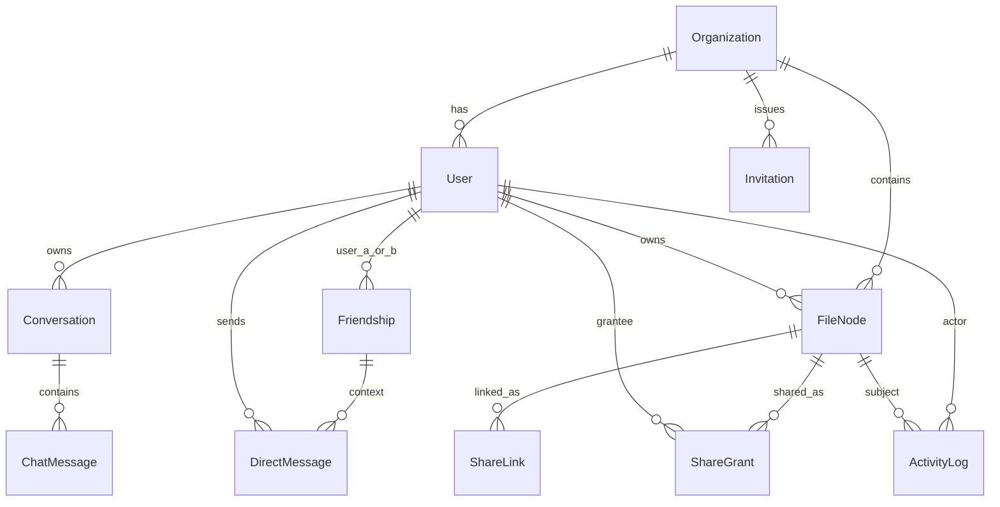
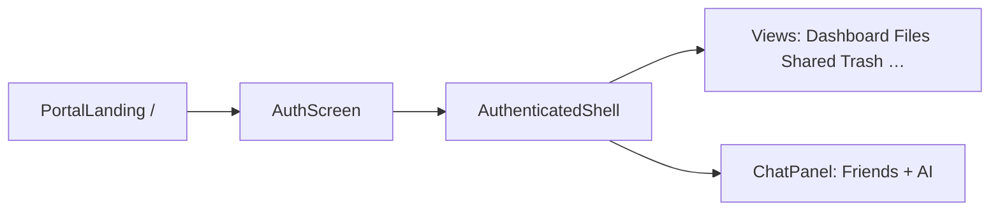

# NexusStorage — Backend & Frontend Structure

One reference for **backend classes/objects** and **frontend modules**. For a short OOP primer, see [CLASS_VS_OBJECT.md](CLASS_VS_OBJECT.md). For day-to-day use, see [SYSTEM_USAGE.md](SYSTEM_USAGE.md).

---

# Part 1 — Backend

**Source apps:** `backend/accounts`, `backend/storage`, `backend/assistant`, `backend/messaging`, `backend/config`.

## App map

```text
accounts (identity)  →  storage (files)  →  assistant (AI)  →  messaging (DMs)
         ↓                      ↓
    Organization / User    FileNode / Share*
```

| App | Job |
|-----|-----|
| **accounts** | Organizations, users, JWT login, invites, org/system admin APIs |
| **storage** | Files/folders, shares, activity logs, dashboard analytics |
| **assistant** | AI conversations and messages |
| **messaging** | Friendships and direct messages |
| **config** | Django settings, URL routing, mail helper |

## Class vs object (models)

| Class (blueprint) | Example object (one DB row / instance) |
|-------------------|----------------------------------------|
| `Organization` | Workspace `"Acme Corp"` with slug `acme` |
| `User` | `superadmin@nexusstorage.local` (role `superadmin`) |
| `Invitation` | Pending invite for `alice@acme.com` as role `user` |
| `FileNode` | File `"report.pdf"` owned by Alice under folder `"Docs"` |
| `ShareGrant` | Grant allowing Bob to download Alice’s file |
| `ShareLink` | Time-limited public link object for that file |
| `ActivityLog` | Row: Alice uploaded `report.pdf` at timestamp T |
| `Conversation` | AI thread titled `"AI Chat"` owned by Alice |
| `ChatMessage` (assistant) | User prompt + assistant reply in that conversation |
| `Friendship` | Alice ↔ Bob friendship with Alice’s `cleared_at` / `hidden` flags |
| `DirectMessage` | One DM from Alice to Bob |

---

## Models (complete catalog)

### accounts (`backend/accounts/models.py`)

| Class | Kind | Notes |
|-------|------|--------|
| `Organization` | Model | Tenant: name, slug, storage limits, flags (`is_active`, self-registration, 2FA required) |
| `UserManager` | Manager | Custom create/get for email-based users |
| `User` | Model (`AbstractUser`) | Belongs to `Organization`; roles `user` / `admin` / `superadmin`; TOTP fields |
| `Invitation` | Model | Tokenized invite into an org with a role |

`User.Role` is an inner TextChoices enum on the `User` class (not a separate table).

### storage (`backend/storage/models.py`)

| Class | Kind | Notes |
|-------|------|--------|
| `FileNode` | Model | File or folder; FK to `Organization`, owner `User`, optional parent folder |
| `ShareGrant` | Model | User-to-user share of a node; status pending/accepted |
| `ShareLink` | Model | Public/token link for a node; hashed token/password |
| `ActivityLog` | Model | Audit trail of storage actions |

### assistant (`backend/assistant/models.py`)

| Class | Kind | Notes |
|-------|------|--------|
| `Conversation` | Model | AI chat thread; FK to owner `User` |
| `ChatMessage` | Model | Message in a conversation (`role` user/assistant) |

### messaging (`backend/messaging/models.py`)

| Class | Kind | Notes |
|-------|------|--------|
| `Friendship` | Model | Pair of users + per-user sticky clear/hide fields |
| `DirectMessage` | Model | One message between friends |

---

## Serializers (complete catalog)

### accounts (`backend/accounts/serializers.py`)

| Class | Purpose |
|-------|---------|
| `OrganizationSerializer` | Org read/write for settings |
| `UserSerializer` | Current user / profile payload |
| `RegisterSerializer` | Self-register into org by slug |
| `LoginSerializer` | JWT obtain + **portal role check** |
| `AdminUserUpdateSerializer` | Org admin updates a member |
| `ProfileUpdateSerializer` | Self profile edits |
| `PasswordChangeSerializer` | Change password |
| `InvitationCreateSerializer` | Create invite |
| `InvitationAcceptSerializer` | Accept invite and create user |
| `WorkspaceSerializer` | Super-admin workspace list/detail |
| `WorkspaceCreateSerializer` | Create workspace + first admin |
| `SystemUserSerializer` | Cross-tenant user list |
| `SystemAdminCreateSerializer` | Create admin under a workspace |
| `SystemUserUpdateSerializer` | Promote/demote/suspend/reset |

### storage (`backend/storage/serializers.py`)

| Class | Purpose |
|-------|---------|
| `FileNodeSerializer` | File/folder JSON |
| `FolderCreateSerializer` | Create folder |
| `FileUploadSerializer` | Multipart upload validation |
| `FileScanSerializer` | Scan status payload |
| `ShareGrantSerializer` | Share grant read |
| `ShareGrantCreateSerializer` | Create grant |
| `ShareLinkCreateSerializer` | Create link |
| `ActivityLogSerializer` | Activity feed item |

### assistant (`backend/assistant/serializers.py`)

| Class | Purpose |
|-------|---------|
| `ChatMessageSerializer` | AI message |
| `ConversationSerializer` | AI conversation + nested messages |
| `PromptSerializer` | Incoming user prompt body |

### messaging (`backend/messaging/serializers.py`)

| Class | Purpose |
|-------|---------|
| `ChatUserSerializer` | Friend / search result user |
| `DirectMessageSerializer` | DM payload |
| `SendMessageSerializer` | Outgoing DM body |
| `AddFriendSerializer` | Add-friend body |

---

## Views / ViewSets (API entry points)

### Auth & accounts — `/api/auth/...` (`backend/accounts/views.py`)

| Class | Typical routes | Role |
|-------|----------------|------|
| `RegisterView` | `POST /api/auth/register/` | Public |
| `LoginView` | `POST /api/auth/login/` | Public (+ portal) |
| `MeView` | `GET/PATCH /api/auth/me/` | Authenticated |
| `PasswordChangeView` | password change | Authenticated |
| `TwoFactorSetupView` | 2FA setup | Authenticated |
| `TwoFactorConfirmView` | confirm 2FA | Authenticated |
| `TwoFactorDisableView` | disable 2FA | Authenticated |
| `LogoutView` | logout / blacklist refresh | Authenticated |
| `OrganizationSettingsView` | org settings | Admin |
| `OrganizationDataClearView` | danger clear | Admin |
| `WorkspaceListCreateView` | system workspaces | Super admin |
| `WorkspaceDetailView` | workspace CRUD | Super admin |
| `SystemUserListCreateView` | system users | Super admin |
| `SystemUserDetailView` | system user detail | Super admin |
| `SystemOverviewView` | platform overview | Super admin |
| `UserListView` | org users | Admin |
| `UserDetailView` | org user detail | Admin |
| `InvitationCreateView` | create invite | Admin |
| `InvitationAcceptView` | accept invite | Public |

### Storage — `/api/...` (`backend/storage/views.py`)

| Class | Role |
|-------|------|
| `FileNodeViewSet` | Tenant files/folders CRUD, trash, restore, upload, download |
| `ShareGrantViewSet` | List/create/respond to grants |
| `PublicShareView` | Token-based public access |
| `ActivityListView` | Activity feed |
| `DashboardView` | User dashboard stats |
| `AdminAnalyticsView` | Org analytics |

### Assistant — `/api/assistant/...` (`backend/assistant/views.py`)

| Class | Role |
|-------|------|
| `ConversationViewSet` | List/create/update/delete AI conversations; send prompts |

### Messaging — `/api/messaging/...` (`backend/messaging/views.py`)

| Class | Role |
|-------|------|
| `FriendListView` | List friends |
| `FriendSearchView` | Search org users |
| `AddFriendView` | Add friend |
| `ConversationMessagesView` | List/send DMs; clear sticky |
| `RemoveFriendView` | Remove / hide friendship for current user |

---

## Services & helpers

| Class / module | Location | Role |
|----------------|----------|------|
| `AssistantService` | `assistant/services.py` | Builds AI replies (Ollama / Groq / fallback) |
| `ActivityLogger` | `storage/services.py` | Writes `ActivityLog` rows |
| `ScanResult` | `storage/antivirus.py` | Result object from virus scan |
| `EmailDeliveryError` | `config/mailer.py` | Exception when mail fails |
| Mail helpers | `config/mailer.py` | Send invite / share emails |
| TOTP / security helpers | `accounts` security modules | Encrypt secrets, verify codes |
| `Command` (`ensure_superadmin`) | `accounts/management/commands/` | Ensure default super admin exists |

---

## Permissions

| Class | Location | Allows |
|-------|----------|--------|
| `IsActiveTenantUser` | `accounts/permissions.py` | Active user in an active org |
| `IsOrganizationAdmin` | `accounts/permissions.py` | Org `admin` role |
| `IsSuperAdmin` | `accounts/permissions.py` | Platform `superadmin` |
| `CanAccessNode` | `storage/permissions.py` | Owner or accepted share access to a `FileNode` |

---

## Managers / AppConfigs / Admin

| Class | Location |
|-------|----------|
| `UserManager` | `accounts/models.py` |
| `AccountsConfig` | `accounts/apps.py` |
| `StorageConfig` | `storage/apps.py` |
| `AssistantConfig` | `assistant/apps.py` |
| `MessagingConfig` | `messaging/apps.py` |
| `CustomUserAdmin` | `accounts/admin.py` |

Test suites also define classes such as `StorageApiTests` (`storage/tests.py`); those are for automated tests, not production API objects.

---

## Relationship diagram



### How objects point to each other (example)

1. **Organization** object `Acme` exists.
2. **User** objects Alice and Bob have `organization_id` → Acme.
3. **FileNode** object `report.pdf` has `owner` → Alice and `organization` → Acme.
4. **ShareGrant** object points to that `FileNode` and grantee Bob.
5. **Friendship** object links Alice and Bob; **DirectMessage** objects reference that pair.
6. **Conversation** + **ChatMessage** objects belong only to Alice for AI Chat.

Tenant APIs always filter querysets by the authenticated user’s organization so Alice cannot load Bob’s org data by guessing IDs.

---

# Part 2 — Frontend

React + TypeScript here is mostly **function components** and **interfaces/types**, not OOP classes. Treat types as **blueprints** and runtime values / on-screen UI as **objects**.

## High-level flow



| Step | What happens |
|------|----------------|
| Portal | User opens `/`, `/user`, `/admin`, or `/system` |
| Auth | Login/register; JWT stored for **that portal only** |
| Shell | Sidebar + header + active view + optional chat panel |
| Views / Chat | Feature screens and messaging panes |

## Entry files

| File | Role |
|------|------|
| [`src/app/App.tsx`](../src/app/App.tsx) | Router + React Query provider; mounts portal routes |
| [`src/app/components/AppContent.tsx`](../src/app/components/AppContent.tsx) | Portal auth gate + **`AuthenticatedShell`** (live app shell) |
| [`src/app/api.ts`](../src/app/api.ts) | Types + HTTP API client objects |
| [`src/app/types/app-types.ts`](../src/app/types/app-types.ts) | UI-facing types (`UserProfile`, `FileItem`, `View`, …) |
| [`src/app/form-modals.tsx`](../src/app/form-modals.tsx) | Storage meters + confirm/prompt modal hooks |

---

## Type / interface blueprints

### From `api.ts` (wire / API shapes)

| Blueprint | Describes |
|-----------|-----------|
| `ApiUser` | Authenticated user from `/auth/me` |
| `Workspace` | Super-admin organization row |
| `SystemUser` | Cross-tenant user row |
| `SystemOverview` | Platform stats |
| `OrganizationSettings` | Org settings payload |
| `ApiFile` | File/folder node from storage API |
| `ActivityLog` | Activity feed item |
| `ShareRequest` | Share grant / request |
| `ChatMessage` | AI message (API) |
| `Conversation` | AI conversation |
| `ChatContact` | Friend list / search hit |
| `DirectChatMessage` | Friend DM |
| `Portal` | `"user" \| "admin" \| "system"` |
| `ApiError` | **class** extending `Error` for HTTP failures |
| `PortalMismatchError` | **class** when role ≠ portal |

### From `types/app-types.ts` (UI shapes)

| Blueprint | Describes |
|-----------|-----------|
| `UserProfile` | App shell user (mapped from `ApiUser`) |
| `FileItem` | Card/table file presentation |
| `ChatMessage` | UI chat bubble (`from: user \| ai`) |
| `Role`, `View`, `FileType`, `ViewMode`, `Theme` | Union type aliases |

**Blueprint vs object:** `interface FileItem` is the shape; one uploaded `report.pdf` rendered as a card is an **object** matching that shape.

---

## API objects (singletons)

These are plain objects with methods (not React components). One shared client per concern:

| Object | File | Talks to |
|--------|------|----------|
| `authApi` | `api.ts` | `/api/auth/*` login, me, 2FA, logout |
| `fileApi` | `api.ts` | Files, folders, trash, shares, upload |
| `dashboardApi` | `api.ts` | Dashboard stats |
| `adminApi` | `api.ts` | Org users, analytics, settings |
| `superAdminApi` | `api.ts` | Workspaces, system users, overview |
| `chatApi` | `api.ts` | `/api/assistant/*` AI conversations |
| `messagingApi` | `api.ts` | `/api/messaging/*` friends + DMs |

Helpers (functions, not classes): `portalFromPath`, `portalForRole`, `portalHome`, `clearTokens`, token get/set.

### Portal session objects (localStorage)

| Key pattern | Meaning |
|-------------|---------|
| `nexus_user_access` / `nexus_user_refresh` | User portal JWT |
| `nexus_admin_access` / `nexus_admin_refresh` | Admin portal JWT |
| `nexus_system_access` / `nexus_system_refresh` | System portal JWT |

Sessions do **not** share tokens across portals.

---

## UI components (functions → on-screen objects)

### Shell (live)

| Component | File | Job |
|-----------|------|-----|
| `App` | `App.tsx` | Routes |
| `PortalLanding` | `PortalLanding.tsx` | Choose portal |
| `AppContent` | `AppContent.tsx` | Load session, show auth or shell |
| `AuthenticatedShell` | `AppContent.tsx` | Layout: sidebar, header, view, chat, drop overlay |
| `WorkspaceLoader` | `WorkspaceLoader.tsx` | Boot splash |
| `AuthScreen` | `AuthScreen.tsx` | Login / register / invite accept |
| `Sidebar` | `Sidebar.tsx` | Nav + storage meter |
| `Header` | `Header.tsx` | Top bar |
| `DropOverlay` | `DropOverlay.tsx` | Full-window drag upload cue |
| `ChatPanel` | `ChatPanel.tsx` | Friends / AI tabs |
| `FriendsChatPane` | `ChatPanel.tsx` | Human DMs |
| `AiChatPane` | `ChatPanel.tsx` | AI conversations |

### Views (live)

| Component | Portal focus |
|-----------|--------------|
| `DashboardView` | User / admin home |
| `FilesView` | My Files |
| `SharedView` | Shared with me |
| `TrashView` | Trash + restore |
| `ProfileView` | Profile + 2FA |
| `AdminAnalytics` | Admin analytics |
| `UserManagement` | Org users / invites |
| `SystemSettings` | Org settings |
| `WorkspacesView` | Super admin workspaces |
| `AdministratorsView` | Super admin users |

### Shared helpers (live)

| Symbol | File | Job |
|--------|------|-----|
| `StorageMeter` | `form-modals.tsx` | Quota bar UI |
| `StorageFullNotice` | `form-modals.tsx` | Full-quota modal copy |
| `useFormPrompt` | `form-modals.tsx` | Modal text/form prompt |
| `useConfirm` | `form-modals.tsx` | Confirm dialog |
| `useNotice` | `form-modals.tsx` | Notice dialog |
| `AppAvatar`, `AppBadge` | components | Avatar / role badge |
| `StatCard` | `StatCard.tsx` | Dashboard/analytics tiles |
| `ShareDialog` | `ShareDialog.tsx` | Share file UI |
| `TwoFactorDialog` | `TwoFactorDialog.tsx` | 2FA enrollment |

---

## Live vs legacy under `src/app/components/`

**Live path:** `App.tsx` → `AppContent` / `AuthenticatedShell` → the view and chat components listed above (plus `ui/` primitives such as button, dialog, etc.).

**Likely unused / leftover UI** (present on disk but not wired into the current shell imports):

| File | Note |
|------|------|
| `FileCard.tsx`, `FileTable.tsx` | Older file presentation |
| `ShareModal.tsx` | Superseded by `ShareDialog` |
| `UploadZone.tsx`, `EmptyState.tsx`, `FileGridSkeleton.tsx` | Older upload/empty states |
| `AdminDashboard.tsx` | Older admin home |
| `RoleSelector.tsx` | Older role picker |
| `figma/ImageWithFallback.tsx`, `shared/ImageWithFallback.tsx` | Design leftovers |

Prefer editing the **live** components when changing product behavior.

---

## Class usage on the frontend

Almost everything is a **function** or **interface**. True TypeScript **classes** in the app layer:

- `ApiError`
- `PortalMismatchError`

React components are **functions** that, when React calls them, produce UI element trees (the “objects” on screen). They are not Django-style model classes.

---

## Related documentation

- [System usage](SYSTEM_USAGE.md)
- [Class vs object primer](CLASS_VS_OBJECT.md)
- [Remaining work plan](REMAINING_WORK_PLAN.md)
- [Chapter 3 — System Analysis and Design](report/CHAPTER_3_SYSTEM_ANALYSIS_AND_DESIGN.md)
- [Chapter 4 — Implementation and Testing](report/CHAPTER_4_IMPLEMENTATION_AND_TESTING.md)
