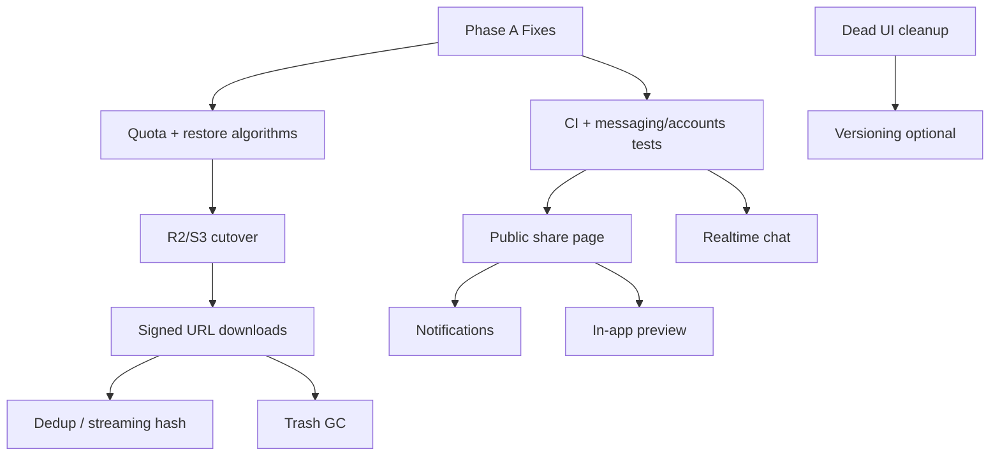

# NexusStorage — Remaining Work Plan

Plan for what is **already done**, what to **fix**, what features to **finish**, which **algorithms** to harden, how to **test/validate**, and how to use **free cloud object-storage APIs**.

Related docs: [SYSTEM_USAGE.md](SYSTEM_USAGE.md) · [ARCHITECTURE.md](ARCHITECTURE.md)

---

## 0. Current status (baseline)

### Already feature-complete

| Area | Status |
|------|--------|
| Multi-tenant portals (`/user`, `/admin`, `/system`) + JWT isolation | Done |
| Auth, invites, org settings, TOTP 2FA | Done |
| Files: upload, folders, rename/move/star/duplicate, trash/restore | Done |
| Sharing: email grants + secure links (hashed tokens) | Done |
| Dashboard, admin analytics, super-admin workspaces/admins | Done |
| Friends chat (REST + 2s polling) + AI conversations | Done |
| Heuristic antivirus + optional ClamAV | Done |
| S3-compatible backend switch (`STORAGE_BACKEND=local\|s3`) | Wired |
| Storage API tests (upload, share, AV, 2FA, superadmin) | Partial |
| System/OOP documentation under `docs/` | Done |

### Biggest remaining gaps

1. Correctness holes (restore vs quota, user vs org quota, download proxy)
2. Half-real settings (backups / API keys / digests toggles)
3. No public share **page** (API URL only)
4. Almost no messaging / accounts / frontend / CI tests
5. Chat is polling, not realtime
6. Cloud storage configured but downloads still stream through Django

---

## 1. Phase A — Fixes (correctness & honesty)

**Goal:** Ship trustable behavior before new features.

| ID | Fix | Why | Primary files |
|----|-----|-----|---------------|
| A1 | **Quota check on restore** (and folder restore subtree) | Trashed files don’t count toward usage → restore can exceed quota | `storage/views.py` `restore` |
| A2 | **Enforce one quota rule** | Upload uses org quota; dashboard shows `user.effective_storage_quota` | `storage/views.py`, `accounts/models.py` |
| A3 | **Verify size after save** | Quota currently trusts `uploaded.size` | `FileNodeViewSet.upload` |
| A4 | **Settings honesty** | Disable or implement Automatic backups / API keys / email digests | `SystemSettings.tsx`, org model |
| A5 | **Expose `allow_public_links`** in admin UI | Backend can 403; UI can’t toggle | `SystemSettings.tsx` |
| A6 | **Search honesty** | Placeholder says “people” but only files search | `Header.tsx` |
| A7 | **Folder search → open folder** | Clicking a folder in search only clears query | `Header.tsx`, `FilesView` / shell |
| A8 | **Restore under trashed parent** | Child can restore while parent stays in trash | `storage/views.py` |
| A9 | **Public share ActivityLog** | Authenticated downloads log; public path does not | `PublicShareView` |

**Exit criteria:** Dedicated tests for A1–A3, A8; settings UI matches backend capability; search copy matches behavior.

---

## 2. Phase B — Feature completion

**Goal:** Close incomplete product surfaces users already expect.

### B1 — Public share recipient UX (P0)

- Add frontend route e.g. `/s/:token` (password prompt → preview/download).
- ShareDialog should copy that URL, not only `/api/public/shares/...`.
- Optional: short-lived redirect to signed object URL when on S3.

### B2 — Notifications vs activity (P1)

- Keep activity feed for audit.
- Add real notification model (or unread flags): share request, invite, DM.
- Header bell: mark-as-read, no permanent red dot on any activity.

### B3 — In-app preview (P1)

- Modal viewer for images + PDF (browser-capable types).
- Clear “download to open” for unsupported types.
- Keep authenticated blob fetch; later use signed URLs (Phase D).

### B4 — Realtime friends chat (P1)

- Replace 2s `setInterval` polling in `ChatPanel.tsx`.
- Preferred: Django Channels / ASGI WebSocket, or SSE for messages.
- Keep REST as fallback; document until realtime ships.

### B5 — Admin capability toggles that stay (P1/P2)

Only keep settings that will be implemented:

| Setting | Plan |
|---------|------|
| `allow_public_links` | Wire UI (A5) |
| `automatic_backups` | Remove/hide **or** add scheduled export job (P2) |
| `api_access` | Remove/hide **or** issue scoped API keys (P2) |
| `email_notifications` | Wire digest cron **or** rename to “transactional email only” |

### B6 — Cleanup dead UI (P2)

Delete or archive unused: `ShareModal`, `FileCard`, `FileTable`, `AdminDashboard`, `UploadZone`, `EmptyState`, `FileGridSkeleton`, `RoleSelector`, ImageWithFallback dupes, `mockData.ts`, unused `AuthContext`.

### B7 — File versioning (P2)

- Model `FileVersion` (or content-addressed blobs + versions).
- API: list / restore version.
- UI: History action (icon already hinted in FilesView).

**Exit criteria:** Share link works in browser for recipients; settings match reality; chat either realtime or clearly labeled “near-realtime”; dead mock UI removed or gated.

---

## 3. Phase C — Perfect algorithms (storage core)

**Goal:** Correct, scalable storage math and scan pipeline — not “more UI”.

### C1 — Quota reservation algorithm (must)

```text
BEGIN
  LOCK org (or OrganizationQuota row)
  effective_limit = min(user.effective_quota, org.quota)   # single rule
  if used + incoming > limit → REJECT
  reserve += incoming                                      # or update counter with F()
  COMMIT lock early if possible
WRITE object to storage
BEGIN
  create FileNode metadata + checksum
  finalize used counter
COMMIT
on failure → release reservation + delete orphan object
```

Also apply the **same check** on: upload, duplicate, **restore**, future chunked-complete.

Prefer maintained `Organization.storage_used_bytes` (updated with `F()` expressions) over `Sum(size_bytes)` on every write.

### C2 — Streaming checksum + optional dedup (should)

1. Hash once while streaming to storage (avoid triple read: AV + checksum + save).
2. Optional content-addressed blob table: `(sha256, size) → storage_key` + refcount.
3. `duplicate` increments refcount instead of copying bytes.

### C3 — Antivirus pipeline (should)

| Step | Behavior |
|------|----------|
| Gate | Extension / MIME / max size |
| Scan | Full object or ClamAV daemon stream |
| Policy | Fail-closed when `ANTIVIRUS_MODE=clamav` and ClamAV down |
| State | `scan_status`: pending → clean \| infected \| error |
| Download | Block until clean (or admin override) |
| Archives | Recurse zip/office (later) |

Heuristic mode stays default for local/dev; production docs recommend ClamAV.

### C4 — Trash GC (should)

- TTL field / policy (e.g. 30 days).
- Management command + scheduler (cron or Celery beat): purge expired trash (bytes + rows).
- Document: soft-delete frees quota → restore must re-check (A1).

### C5 — Signed URL download/upload (must for cloud)

```text
AuthZ OK → ActivityLogger → redirect or JSON { url: presigned GET }
Client fetches bytes from R2/S3/B2 directly (not through Django)
```

Large uploads later: presigned PUT / multipart initiate–complete → server finalizes metadata + quota.

### C6 — Chunked / resumable upload (P2 scale)

- `UploadSession` + parts + reserved quota.
- Complete only when assembled size + checksum match.

**Exit criteria:** Concurrent upload tests pass; restore cannot exceed quota; S3 download uses redirect/presign; AV policy documented and tested.

---

## 4. Phase D — Free cloud storage APIs

**Goal:** Store file **bytes** on a free/cheap S3-compatible provider. App DB stays PostgreSQL (or SQLite for local).

### Already supported

Set in `.env` (see `.env.example`):

```env
STORAGE_BACKEND=s3
AWS_ACCESS_KEY_ID=...
AWS_SECRET_ACCESS_KEY=...
AWS_STORAGE_BUCKET_NAME=...
AWS_S3_ENDPOINT_URL=...
AWS_S3_REGION_NAME=auto
AWS_QUERYSTRING_EXPIRE=900
```

Uses `django-storages` S3 backend in `backend/config/settings.py`.

### Recommended free / free-tier options

| Provider | Why choose it | Endpoint pattern |
|----------|---------------|------------------|
| **Cloudflare R2** (preferred) | Generous free tier, **no egress fees**, S3 API | `https://<ACCOUNT_ID>.r2.cloudflarestorage.com` |
| **Backblaze B2** | Strong free storage allowance | S3-compatible B2 endpoint |
| **Supabase Storage** | Convenient if already on Supabase | Project S3 endpoint |
| **MinIO** (self-host) | Free, local/dev parity with cloud S3 | `http://localhost:9000` |

> Do **not** put private files in public buckets. Keep bucket private; use authenticated API + (after C5) short-lived signed URLs.

### Rollout steps

1. Create private bucket + API token on R2 (or B2/Supabase/MinIO).
2. Configure CORS on the bucket if browsers will GET signed URLs directly.
3. Sync existing `backend/media/organizations/...` keys into the bucket (`rclone` / `aws s3 sync` against custom endpoint) **keeping the same object keys**.
4. Flip `STORAGE_BACKEND=s3` and fill `AWS_*`.
5. Smoke: upload → list → preview → download → permanent delete → public share.
6. Keep local media as backup until verified.
7. Implement C5 (presigned redirects) so Django is not the bandwidth bottleneck.

### Out of scope for “file storage APIs”

- Google Drive / Dropbox user OAuth as primary store (different product model).
- Putting PostgreSQL on a free DB tier is separate from object storage; keep using Postgres/SQLite as today.

**Exit criteria:** Documented R2 (or chosen provider) runbook in README; staging env on `STORAGE_BACKEND=s3`; download path uses signed URLs.

---

## 5. Phase E — Perfect testing & validation

**Goal:** Automated proof of correctness + a manual validation checklist for releases.

### E1 — Backend unit / API tests

| Suite | New file / expand | Must cover |
|-------|-------------------|------------|
| Storage correctness | `storage/tests.py` | Quota race, restore over-quota, user vs org limit, checksum, trash GC command |
| Messaging | **`messaging/tests.py`** (new) | Add friend, send DM, sticky clear/delete-for-me, search scope |
| Accounts | **`accounts/tests.py`** (new) | Portal login mismatch, invite, 2FA, suspend org, permissions |
| Assistant | **`assistant/tests.py`** (new) | Tenant isolation, create/clear/delete conversation |
| Public share | storage tests | Password, expiry, hashed token, activity log |
| AV | storage tests | EICAR, blocked extension, clamav fail-closed (mocked) |

### E2 — Validation / integration matrix (manual or scripted)

| Flow | Validate |
|------|----------|
| V1 Register admin → invite user → join | Roles + portal lock |
| V2 Upload until quota full | UI modal + HTTP 413 |
| V3 Trash → restore over quota | Blocked after A1 |
| V4 Share grant accept/ignore | Shared view permissions |
| V5 Public link + password | Frontend `/s/:token` after B1 |
| V6 Friends clear/delete for me | Other user retains history |
| V7 AI new/clear/delete chat | Persistence |
| V8 Super admin suspend workspace | Members blocked |
| V9 `STORAGE_BACKEND=s3` smoke | Bytes in bucket; delete removes object |
| V10 2FA enroll + login | Drift tolerance |

### E3 — Frontend tests (P1)

- Add Vitest + React Testing Library.
- Scripts: `"test"`, `"lint"` in `package.json`.
- Priority targets: `api.ts` portal tokens / `PortalMismatchError`, form-modals quota helpers, AuthScreen portal mismatch, ShareDialog URL format.

### E4 — CI (P0)

Add `.github/workflows/ci.yml`:

```text
on: pull_request, push
jobs:
  backend:  venv → migrate → manage.py test
  frontend: npm ci → npm run build → npm test (once added)
```

Optional: matrix job with `STORAGE_BACKEND=s3` against MinIO service container.

### E5 — Definition of done for a release

- [ ] All Phase A fixes merged + tested  
- [ ] CI green on main  
- [ ] Validation matrix V1–V10 signed off  
- [ ] Cloud storage runbook followed on staging  
- [ ] No settings toggle that lies about unimplemented features  

---

## 6. Suggested delivery order



| Sprint | Focus |
|--------|--------|
| **Sprint 1** | A1–A9 fixes + messaging tests + CI |
| **Sprint 2** | C1 quota algorithm + B1 public share page + R2 staging (D) |
| **Sprint 3** | C5 signed URLs + E2 validation pass + settings honesty |
| **Sprint 4** | B3 preview, B2 notifications, B4 realtime (pick one primary) |
| **Sprint 5** | C2/C4 algorithms, B6 cleanup, versioning if needed |

---

## 7. Explicit non-goals (for now)

- Rewriting the frontend into a new framework  
- Multi-region active-active DB  
- Full enterprise DLP / eDiscovery  
- Replacing friends chat with a third-party chat SaaS  
- Charging/billing engine (quotas stay admin-configured)

---

## 8. Quick reference — env for free object storage (R2)

```env
STORAGE_BACKEND=s3
AWS_ACCESS_KEY_ID=<r2_access_key>
AWS_SECRET_ACCESS_KEY=<r2_secret>
AWS_STORAGE_BUCKET_NAME=nexus-storage
AWS_S3_ENDPOINT_URL=https://<ACCOUNT_ID>.r2.cloudflarestorage.com
AWS_S3_REGION_NAME=auto
AWS_QUERYSTRING_EXPIRE=900
```

After Phase C5, downloads should use querystring/presigned URLs instead of proxying file bodies through Gunicorn.
