# Chapter 3: System Analysis and Design

**System:** NexusStorage — Multi-tenant Cloud Storage SaaS  
**Related technical reference:** [ARCHITECTURE.md](../ARCHITECTURE.md) · [CLASS_VS_OBJECT.md](../CLASS_VS_OBJECT.md)

---

## 8.1. System Analysis

System analysis studies **what** NexusStorage must do, whether it is feasible to build, and how objects and processes interact before detailed design and coding.

### 8.1.1. Requirement Analysis

#### i. Functional Requirements

Functional requirements describe **services the system must provide**. They are illustrated with a **use case diagram** and **use case descriptions**.

##### Actors

| Actor | Description |
|-------|-------------|
| **Guest** | Unauthenticated visitor (register, accept invite, open public share) |
| **User** | Organization member (role `user`) on portal `/user` |
| **Admin** | Organization administrator (role `admin`) on portal `/admin` |
| **Super Admin** | Platform operator (role `superadmin`) on portal `/system` |
| **AI Assistant** | External/system actor that generates metadata-grounded replies |
| **Object Storage** | Local disk or S3-compatible cloud (R2/B2/etc.) holding file bytes |

##### Use Case Diagram

```mermaid
flowchart TB
  subgraph Actors
    Guest((Guest))
    User((User))
    Admin((Admin))
    Super((Super Admin))
    AI((AI Assistant))
    Store[(Object Storage)]
  end

  subgraph NexusStorage
    UC01[Register / Login]
    UC02[Manage Profile / 2FA]
    UC03[Upload File]
    UC04[Organize Folders]
    UC05[Search Files]
    UC06[Trash / Restore]
    UC07[Share by Email]
    UC08[Create Secure Link]
    UC09[Access Public Share]
    UC10[Friends Chat]
    UC11[AI Chat]
    UC12[View Dashboard]
    UC13[Invite / Manage Users]
    UC14[Org Settings / Analytics]
    UC15[Manage Workspaces]
    UC16[Manage Administrators]
  end

  Guest --> UC01
  Guest --> UC09
  User --> UC01
  User --> UC02
  User --> UC03
  User --> UC04
  User --> UC05
  User --> UC06
  User --> UC07
  User --> UC08
  User --> UC10
  User --> UC11
  User --> UC12
  Admin --> UC01
  Admin --> UC02
  Admin --> UC03
  Admin --> UC04
  Admin --> UC05
  Admin --> UC06
  Admin --> UC07
  Admin --> UC08
  Admin --> UC10
  Admin --> UC11
  Admin --> UC12
  Admin --> UC13
  Admin --> UC14
  Super --> UC01
  Super --> UC15
  Super --> UC16
  UC03 -.-> Store
  UC06 -.-> Store
  UC09 -.-> Store
  UC11 -.-> AI
```

##### Use Case Descriptions (selected core cases)

**UC01 — Register / Login**

| Field | Detail |
|-------|--------|
| **Actors** | Guest, User, Admin, Super Admin |
| **Precondition** | System running; for login, account exists |
| **Main flow** | 1. Actor opens matching portal (`/user`, `/admin`, `/system`). 2. Submits email/password (and TOTP if enabled). 3. System validates credentials **and** role↔portal match. 4. Issues JWT access/refresh for that portal only. |
| **Alternate** | Wrong portal → reject with portal mismatch (no session). Invalid password → 401. |
| **Postcondition** | Authenticated session stored under portal-specific keys |

**UC03 — Upload File**

| Field | Detail |
|-------|--------|
| **Actors** | User, Admin |
| **Precondition** | Authenticated; organization active; quota available |
| **Main flow** | 1. Select/drop file. 2. Frontend blocks if meter shows storage full. 3. Backend validates size, scans antivirus, locks org quota, stores bytes, saves `FileNode` + SHA-256 checksum. |
| **Alternate** | Virus detected → reject. Quota exceeded → HTTP 413. |
| **Postcondition** | File visible under My Files; activity logged; usage increased |

**UC06 — Trash / Restore**

| Field | Detail |
|-------|--------|
| **Actors** | User, Admin (owner) |
| **Precondition** | Node exists and is owned (or authorized) |
| **Main flow** | Soft-delete sets `deleted_at` (and descendants). Restore clears trash flag. Permanent delete removes bytes + row. |
| **Alternate** | Confirm dialogs cancel action. |
| **Postcondition** | Node in Trash, My Files, or permanently gone |

**UC07 — Share by Email**

| Field | Detail |
|-------|--------|
| **Actors** | User/Admin (owner); User (grantee) |
| **Main flow** | Owner creates `ShareGrant` → grantee sees pending → accept/ignore → accepted files appear under Shared. |
| **Postcondition** | Grantee can preview/download per permission |

**UC08 / UC09 — Secure Link & Public Access**

| Field | Detail |
|-------|--------|
| **Actors** | Owner; Guest (recipient) |
| **Main flow** | Owner creates `ShareLink` (optional password/expiry). System stores **hashed** token. Guest presents token (+ password) to public API. |
| **Postcondition** | Authorized download/preview without full account (API path) |

**UC10 — Friends Chat**

| Field | Detail |
|-------|--------|
| **Actors** | User, Admin (same organization) |
| **Main flow** | Search org users → add friend → send/receive DMs (polled). Clear/delete is **per-user sticky** (other party keeps history). |
| **Postcondition** | `Friendship` / `DirectMessage` rows updated |

**UC11 — AI Chat**

| Field | Detail |
|-------|--------|
| **Actors** | User/Admin; AI Assistant |
| **Main flow** | Create/open `Conversation` → send prompt → `AssistantService` replies using account metadata → persist messages. |
| **Postcondition** | Conversation history saved for that user only |

**UC13–UC16 — Admin / Super Admin**

| Use case | Summary |
|----------|---------|
| UC13 | Invite members; suspend/activate users |
| UC14 | Change org name, quotas, 2FA requirement, view analytics |
| UC15 | Create/suspend/delete workspaces |
| UC16 | Create admins; promote/demote; reset passwords across tenants |

---

#### ii. Non-Functional Requirements

| Category | Requirement | How NexusStorage addresses it |
|----------|-------------|-------------------------------|
| **Security** | Authenticate and authorize all private APIs | JWT + role portals; DRF permissions (`IsActiveTenantUser`, `CanAccessNode`, …) |
| **Security** | Protect secrets at rest | Django password hash; share token/password hashes; TOTP secret encrypted |
| **Security** | Malware scanning on upload | Heuristic AV (+ optional ClamAV) |
| **Privacy / Isolation** | Multi-tenant separation | Every file/user scoped by `Organization`; queryset filters |
| **Reliability** | Soft delete before permanent loss | Trash / restore / empty trash |
| **Integrity** | Detect file tampering / identity | SHA-256 checksum on upload |
| **Usability** | Clear portals and modals | `/user` `/admin` `/system`; form/confirm modals instead of raw `prompt` |
| **Performance** | Acceptable interactive latency | REST + React Query; chat polls ~2s (realtime optional later) |
| **Scalability of storage** | Bytes off app server | `STORAGE_BACKEND=s3` (R2/B2/MinIO) |
| **Maintainability** | Modular apps | `accounts`, `storage`, `assistant`, `messaging` |
| **Auditability** | Trace important actions | `ActivityLog` + `ActivityLogger` |
| **Availability (ops)** | Local and Docker deploy paths | `runserver` / Compose + Gunicorn |

---

### 8.1.2. Feasibility Analysis

#### i. Technical Feasibility — **Feasible**

| Factor | Assessment |
|--------|------------|
| Stack maturity | React, Django, DRF, PostgreSQL, JWT are proven |
| Storage | Local FS for dev; S3 API for cloud (R2 free tier) already wired |
| AI | Optional Ollama/Groq; deterministic fallback when disabled |
| Skills | Web + REST + SQL within student/team capability |
| Risk | Realtime chat / signed-URL bandwidth optimization are enhancements, not blockers |

#### ii. Operational Feasibility — **Feasible**

| Factor | Assessment |
|--------|------------|
| Users | Familiar cloud-drive + chat patterns |
| Roles | Clear portals reduce misuse (admin cannot “accidentally” use user portal session) |
| Admins | Workspace settings and invites match SaaS ops |
| Super admin | Single platform operator for many orgs |
| Training | Covered by [SYSTEM_USAGE.md](../SYSTEM_USAGE.md) |

#### iii. Economic Feasibility — **Feasible (low cost)**

| Cost item | Approach |
|-----------|----------|
| Development | Open-source stack (no license fees) |
| Compute | Local / small VPS |
| Database | PostgreSQL self-host or free-tier cloud DB |
| Object storage | **Cloudflare R2** / Backblaze B2 / MinIO free tiers |
| AI | Local Ollama (free) or free Groq tier; or `AI_PROVIDER=disabled` |
| Email | Console backend in dev; Gmail app password optional |

#### iv. Schedule Feasibility — **Feasible with phased delivery**

| Phase | Scope | Relative effort |
|-------|--------|-----------------|
| Core | Auth, files, trash, share, portals | Completed |
| Collab | Friends chat, AI chat | Completed |
| Hardening | Quota algorithms, tests, CI, R2 cutover | Planned ([REMAINING_WORK_PLAN.md](../REMAINING_WORK_PLAN.md)) |
| Polish | Public share page, preview, websockets | Optional follow-on |

A semester/project timeline can ship **MVP complete** now and schedule hardening in remaining weeks.

---

### 8.1.3. Object Modelling using Class and Object Diagrams

#### Class Diagram (analysis-level domain)

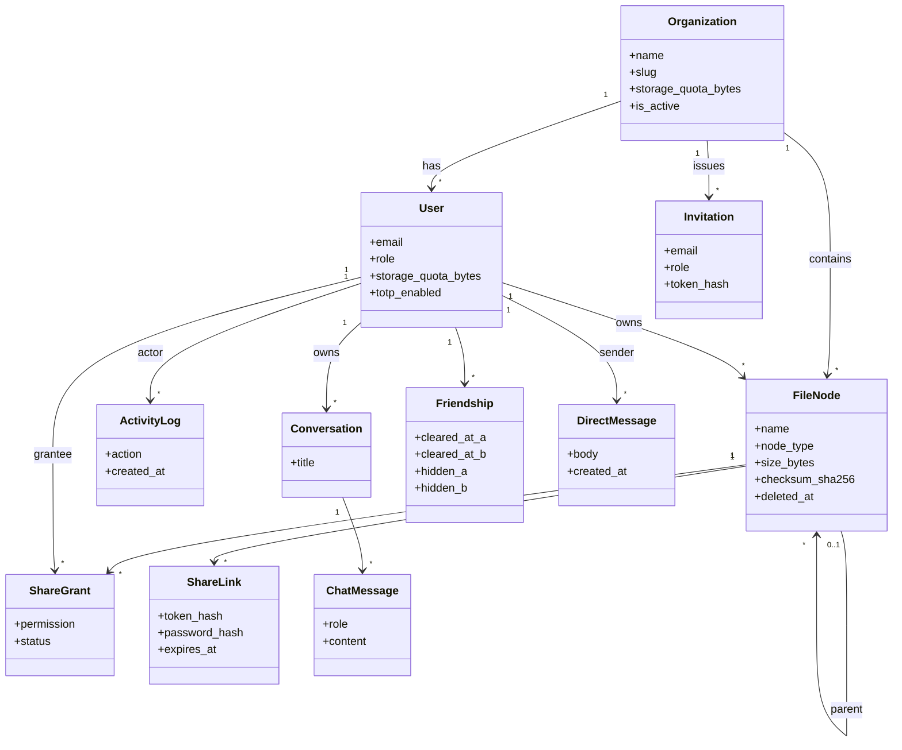

#### Object Diagram (runtime snapshot example)

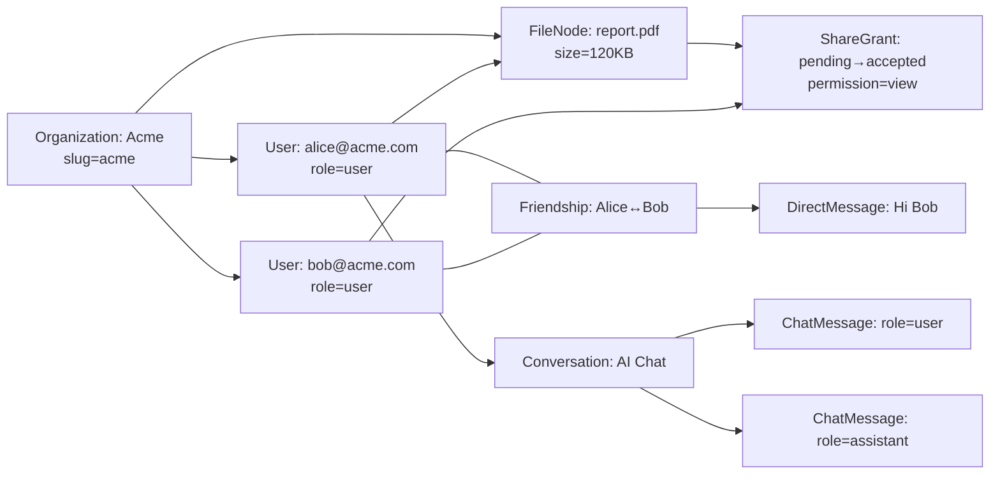

**Class vs object:** `User` is the class (blueprint); `alice@acme.com` is one object. See [CLASS_VS_OBJECT.md](../CLASS_VS_OBJECT.md).

---

### 8.1.4. Dynamic Modelling using State and Sequence Diagrams

#### State Diagram — FileNode lifecycle

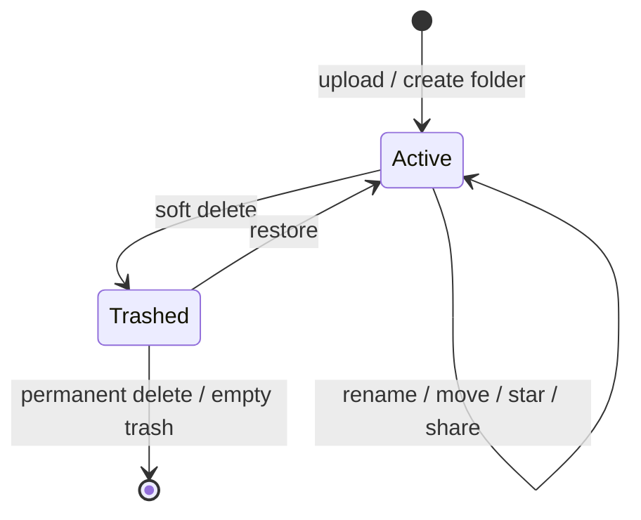

#### State Diagram — ShareGrant

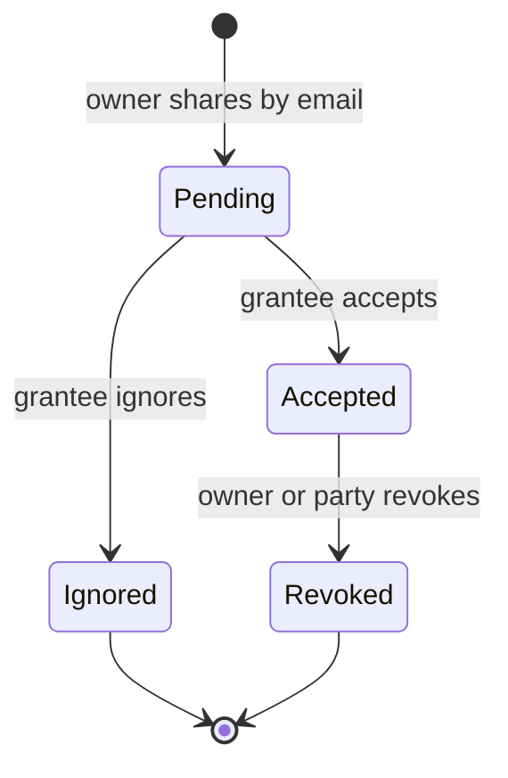

#### State Diagram — User session / portal auth

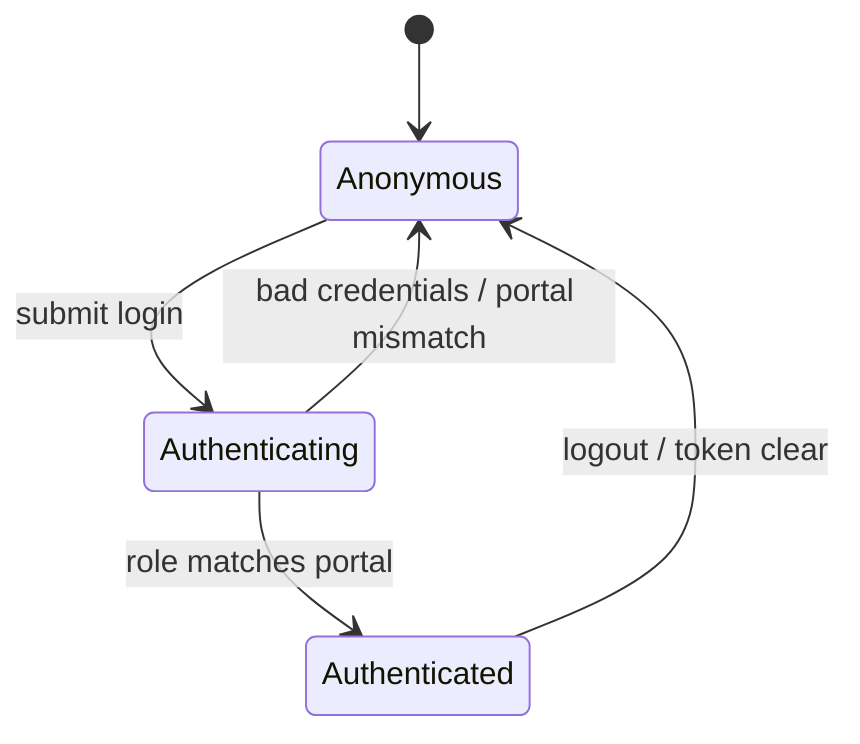

#### Sequence Diagram — Upload file

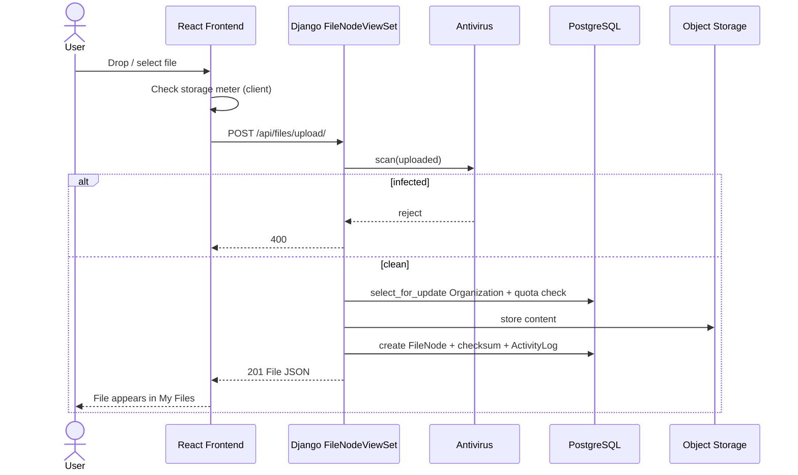

#### Sequence Diagram — Login with portal lock

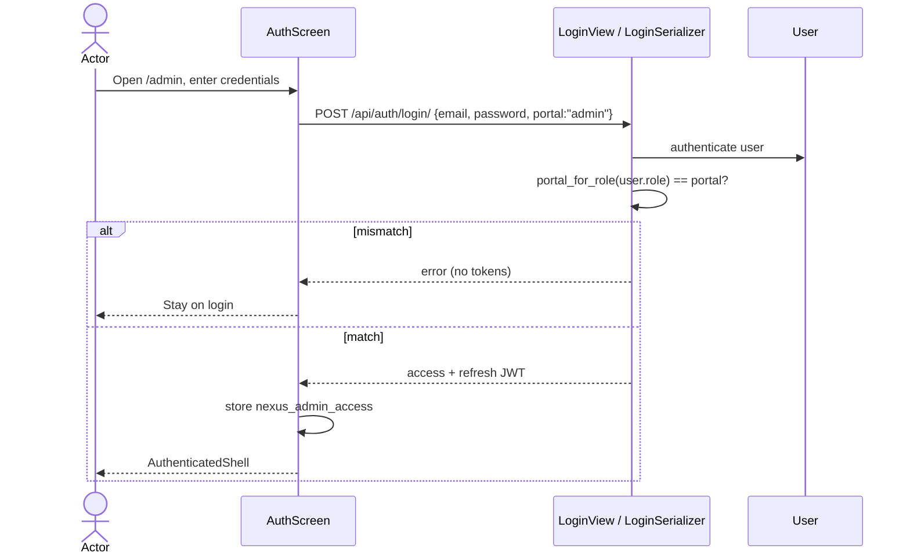

#### Sequence Diagram — Friends message (sticky clear)

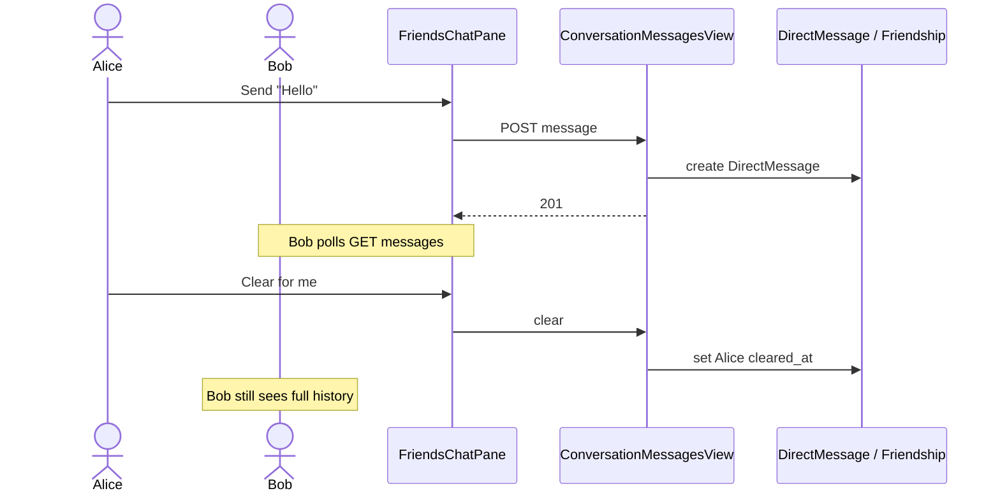

---

### 8.1.5. Process Modelling using Activity Diagrams

#### Activity — Upload with quota and AV

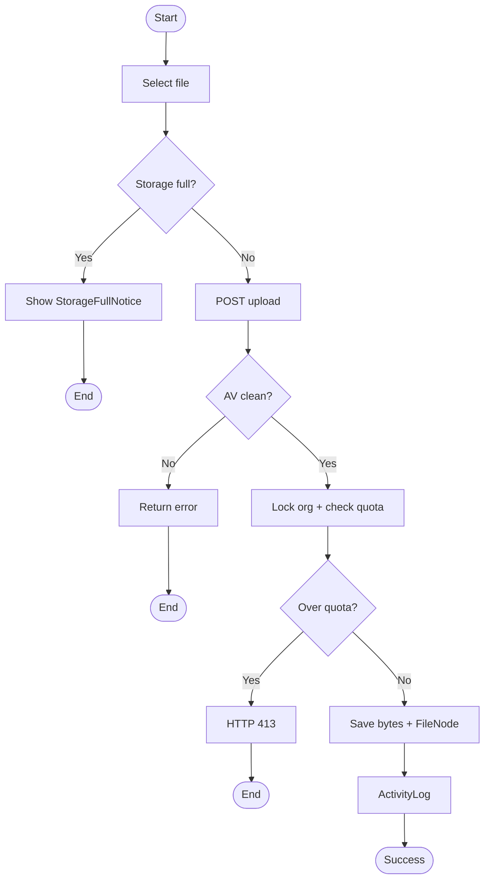

#### Activity — Share by email

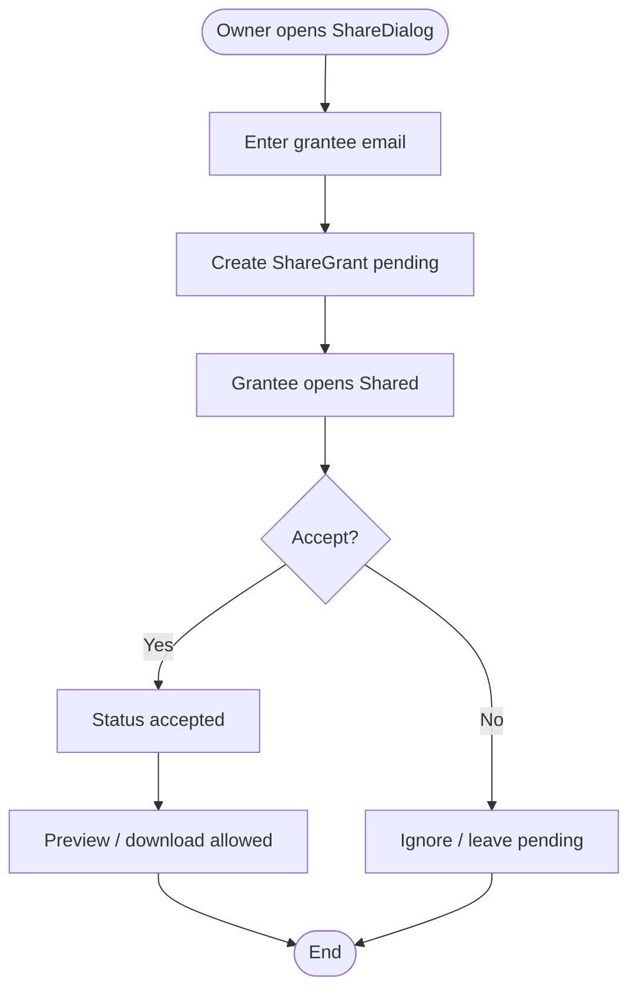

#### Activity — Organization onboarding

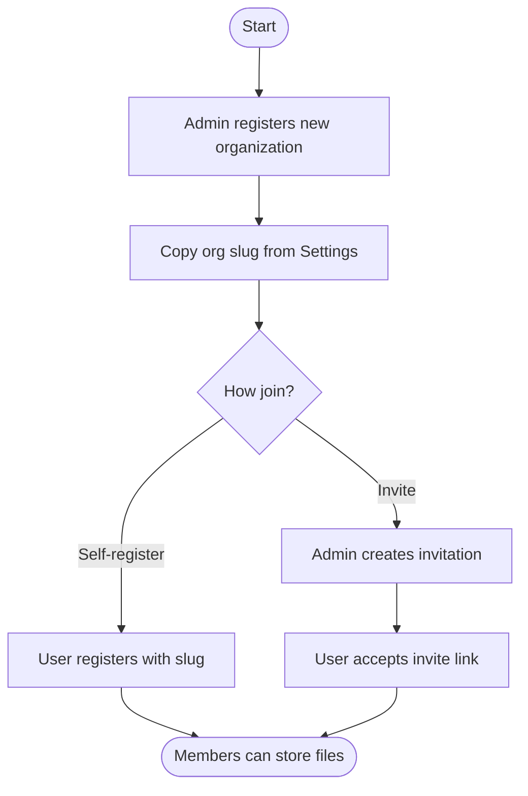

---

## 8.2. System Design

Design refines analysis models into a buildable architecture (layers, components, deployment).

### 8.2.1. Refinement of Class, Object, State, Sequence and Activity Diagrams

| Analysis artifact | Design refinement |
|-------------------|-------------------|
| Domain `User` | Django `AbstractUser` + `UserManager`; JWT claims; portal mapping |
| Domain `FileNode` | `FileField` / S3 storage; soft-delete fields; nested parent FK |
| Share states | Explicit `status` on `ShareGrant`; hashed `ShareLink.token_hash` |
| Upload sequence | Serializer validation → AV → `transaction.atomic` + `select_for_update` → create |
| Chat activity | REST resources + client polling; sticky clear fields on `Friendship` |
| UI objects | TS interfaces (`ApiUser`, `FileItem`) + function components; API singletons (`fileApi`, …) |

**Layered design:**

```text
Presentation (React portals + views)
        ↓ HTTP/JSON JWT
Application API (DRF ViewSets / APIViews)
        ↓
Domain services (AssistantService, ActivityLogger, antivirus)
        ↓
Persistence (Django ORM models) + Object storage (local/S3)
```

Full class catalogs: [ARCHITECTURE.md](../ARCHITECTURE.md).

### 8.2.2. Component Diagrams

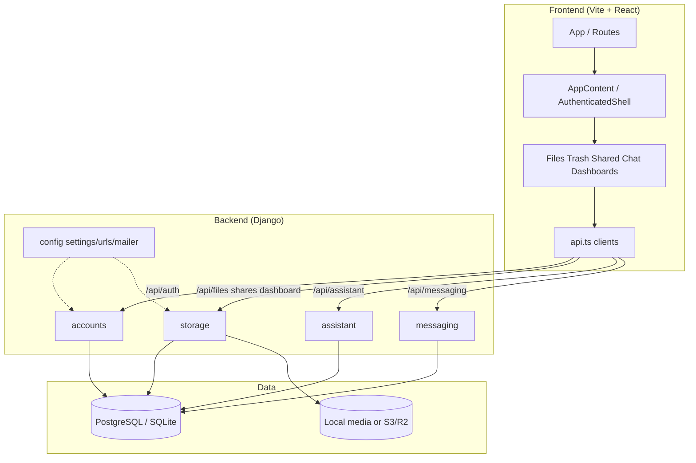

### 8.2.3. Deployment Diagrams

#### Local development

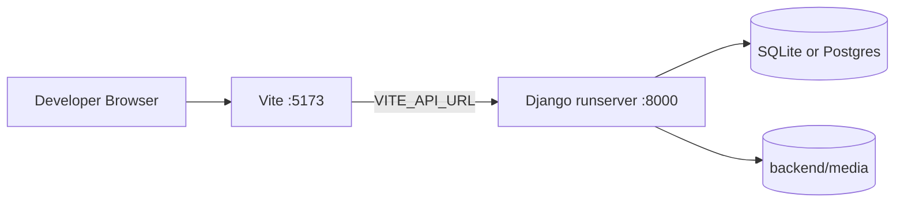

#### Production-style (Compose / cloud)

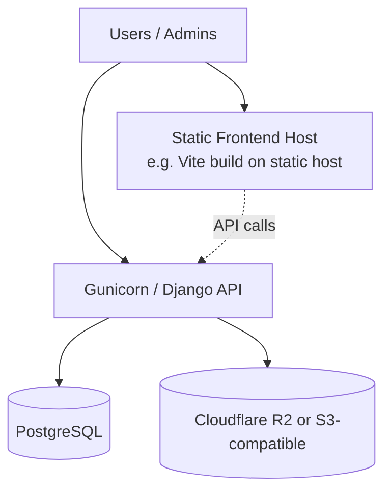

| Node | Technology |
|------|------------|
| Client | Modern browser |
| Frontend build | Vite → static assets |
| API | Django 5.2 + Gunicorn (Compose) |
| DB | PostgreSQL |
| Files | Local or R2/B2/MinIO via `STORAGE_BACKEND=s3` |

---

## 8.3. Algorithm Details

### 8.3.1. Upload quota + antivirus algorithm (current)

```text
INPUT: uploaded file, authenticated user
1. Validate max file size (serializer)
2. Scan with antivirus (heuristic and/or ClamAV) → reject if infected
3. BEGIN TRANSACTION
4.   LOCK Organization row (select_for_update)
5.   used ← SUM(size_bytes) of non-trashed files in org
6.   IF used + file.size > org.storage_quota_bytes THEN REJECT 413
7.   checksum ← SHA-256(file)
8.   Store content to storage backend
9.   Create FileNode(owner, org, checksum, size, ...)
10.  ActivityLogger.log("uploaded")
11. COMMIT
OUTPUT: FileNode JSON
```

### 8.3.2. Soft-delete / restore algorithm

```text
SOFT DELETE:
  mark node.deleted_at = now
  recursively mark descendants

RESTORE:
  clear deleted_at on node (+ descendants as implemented)
  (Design improvement: re-check quota before clear — see remaining work plan)

PERMANENT DELETE:
  delete object bytes from storage
  delete DB row
```

### 8.3.3. Share-link token algorithm

```text
CREATE LINK:
  raw_token ← secure random
  store SHA-256(raw_token) only
  optional password ← Django hasher
  return raw_token once to owner

ACCESS:
  hash presented token; lookup ShareLink
  verify expiry + password
  stream or return file
```

### 8.3.4. Portal authorization algorithm

```text
expected ← map(role → portal)
  user → /user, admin → /admin, superadmin → /system
IF request.portal ≠ expected THEN reject login / clear tokens
ELSE issue JWT stored under nexus_{portal}_access
```

### 8.3.5. Friends sticky clear/delete

```text
CLEAR FOR ME: set cleared_at for current user on Friendship
  LIST messages WHERE created_at > my cleared_at

DELETE FOR ME: set hidden=True (+ clear) for current user only
  other user unchanged; new messages may unhide
```

### 8.3.6. Planned refinements (not all shipped)

- Atomic **quota reservation** + restore re-check  
- Streaming hash / optional content dedup  
- Presigned S3 download URLs  
- Trash TTL garbage collection  

Details: [REMAINING_WORK_PLAN.md](../REMAINING_WORK_PLAN.md) Phase C.

---

## Chapter 3 — Summary

Analysis established functional use cases, non-functional qualities, and four-way feasibility. Object, dynamic, and process models describe NexusStorage’s multi-tenant file and collaboration domain. Design maps those models onto React + Django components and a local/cloud deployment, with explicit algorithms for upload security, sharing, portals, and chat sticky visibility.
